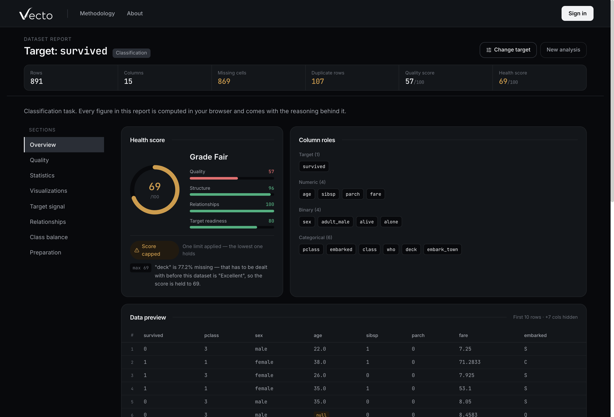
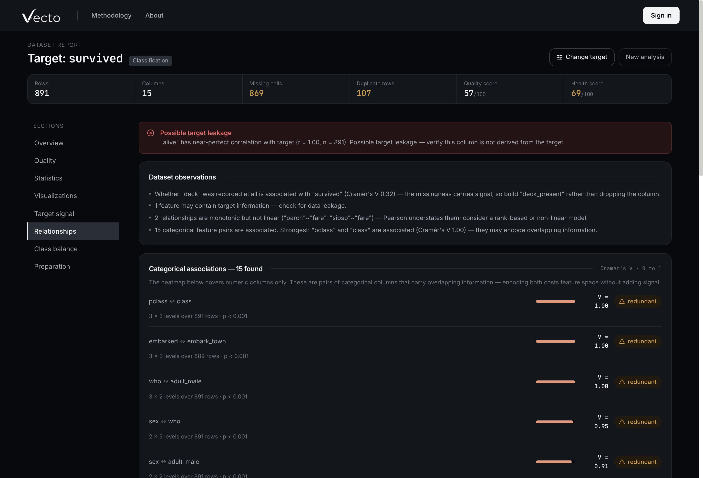

### Know your dataset before you train on it.

A privacy-first workspace for exploring data quality, relationships, target signal and
ML readiness — directly in the browser.

**[Live demo](https://vecto.aannaelj.workers.dev)** ·
[Methodology](https://vecto.aannaelj.workers.dev/methodology) ·
[Privacy](https://vecto.aannaelj.workers.dev/privacy) ·
[About](https://vecto.aannaelj.workers.dev/about)

Upload a CSV → inspect its quality, structure, relationships and target signal → build a
preparation plan.



## What Vecto does

Most tooling tells you what is *in* a dataset. Vecto is built to answer a narrower
question: is this data ready to train on, and what would go wrong if you did?

A report covers data quality and missingness, per-column statistics and outliers, feature
relationships, how much signal the target actually carries, class balance, likely leakage,
a weighted health score, and prioritised recommendations — each figure shown with the
reasoning and the sample size behind it. From the same analysis it builds a preparation
plan and exports it as a runnable scikit-learn pipeline.

It is not a CSV viewer with charts bolted on: every section exists to support or refute
the decision to model the data as it stands.

## Built around deterministic analysis

```text
CSV
 ↓
Browser
 ↓
Deterministic Analysis Engine        ← pure functions, Web Worker, no network
 ↓
Analysis Dashboard
 ↓
Optional Deeper Review               ← only when asked
 ↓
Cloudflare Worker  →  model provider
```

Parsing and analysis run in the page. The engine is a set of pure functions with no
network access, so the same file and the same target produce the same report every time,
and no language model computes any part of it. The report is complete without the AI
layer, without an account, and without a request leaving the browser.

## Analysis engine

Quality and missingness · per-column statistics and skew-adjusted outlier fences · column
role detection · Pearson and Spearman with two-sided p-values · bias-corrected Cramér's V ·
rank-based correlation ratio · mutual information · multicollinearity and leakage signals ·
class balance · health score · recommendations · preparation plan · scikit-learn pipeline
export · a cross-validated baseline model.

Every threshold and method is documented on the
[Methodology](https://vecto.aannaelj.workers.dev/methodology) page.



## Engineering highlights

**Deterministic analysis engine** — pure, side-effect-free functions covered by regression
tests against a Python-generated reference (pandas, scipy) and by contract tests that pin
the exact shape of the engine's output.

**Full-stack architecture** — React/Vite front end, Cloudflare Worker back end, D1 for
persistence, deployed as static assets with the Worker in front of `/api/*`.

**Privacy-aware design** — the raw dataset is never uploaded. Analysis, the preparation
plan and the script export all run client-side; the back end exists only for the optional
review and for accounts.

**AI integration** — a server-side task registry with prompts the client never sends,
strict JSON schemas, and a verification layer that checks every claim against the file
before it is shown: proposed formulas are evaluated on the rows, contradicted column types
are withheld, and unverifiable claims are labelled as questions rather than findings.

**ML preparation** — seeded, deterministic folds; preprocessing fitted on training rows
only; a ridge baseline scored with 5-fold cross-validation and a corrected paired *t*-test,
to say whether the signal is distinguishable from a naive predictor.

**Production concerns** — GitHub OAuth in a popup (a redirect would destroy in-memory
state), opaque sessions stored as hashes, per-user and global quotas, a client-side answer
cache, upstream error handling with bounded retries, and browser-level verification of the
real user journeys.

## AI, where it actually helps

AI is optional. The core report is deterministic and reproducible; a model is introduced
only where semantic interpretation is useful — reading what an ambiguous column probably
records, proposing cleaning rules for messy values, and reviewing candidate leakage.

The dataset itself is never sent. A column review receives derived per-column summaries —
names, roles, counts, summary statistics and a handful of clipped example values — and the
leakage review receives no cell values at all. Nothing a model proposes enters the report
until it has been checked against the file and accepted by the user.

## Privacy by design

```text
CSV
 ↓
Browser
 ├── Quality
 ├── Statistics
 ├── Relationships
 ├── Target Signal
 └── ML Preparation
```

No raw dataset upload is required for the core analysis. When a deeper review is
requested, Vecto sends derived column summaries rather than the original dataset, and
shows exactly what will be sent before the request is made. Details:
[Privacy](https://vecto.aannaelj.workers.dev/privacy).

## Tech stack

**Frontend** React · Vite · React Router · Tailwind CSS · Framer Motion · PapaParse

**Backend** Cloudflare Workers · D1

**AI** OpenRouter

**Data / ML** JavaScript analysis engine · scikit-learn pipeline export

## Methodology and validation

The engine's statistics are checked against a Python reference; contract tests lock the
output shape the interface is built against; hardening tests run malformed and very large
inputs through it. The exported pipeline was validated by running it in Python, and the
baseline model's coefficients match scikit-learn's. User journeys are verified by driving
the real app in a headless browser, not only by unit tests.

```bash
npm test     # analysis engine, AI layer, preparation and baseline
npm run lint
```

## Local development

```bash
git clone https://github.com/ashrafjr-n/Vecto.git
cd Vecto
npm install
npm run dev
```

That runs the whole product except the optional review. For that half, copy
`.dev.vars.example` to `.dev.vars`, fill it in, and run `npx wrangler dev` alongside the
dev server, which proxies `/api` to it.

## Project structure

```text
src/
├── components/utils/core/   the analysis engine (pure functions)
├── lib/                     CSV intake, worker wrapper, prep plan, AI client
├── components/analyze/      target picker and the report
├── pages/                   routes
└── content/                 copy for the documentation pages
worker/                      Cloudflare Worker: auth, quotas, AI tasks
tests/                       plain-Node test suites
```

## Built by Ashraf

A personal project focused on full-stack engineering, data analysis and AI-assisted
workflows — [live](https://vecto.aannaelj.workers.dev) ·
[source](https://github.com/ashrafjr-n/Vecto).

Private project; all rights reserved.
