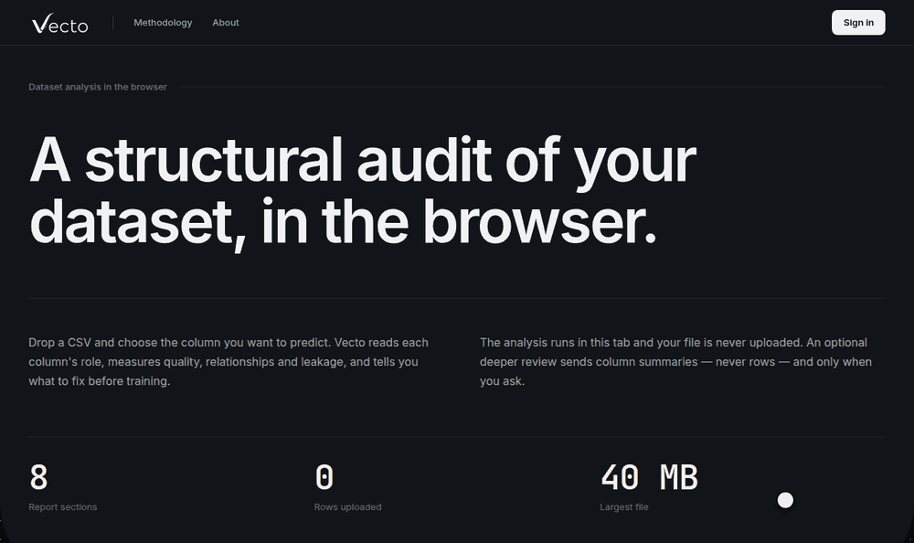
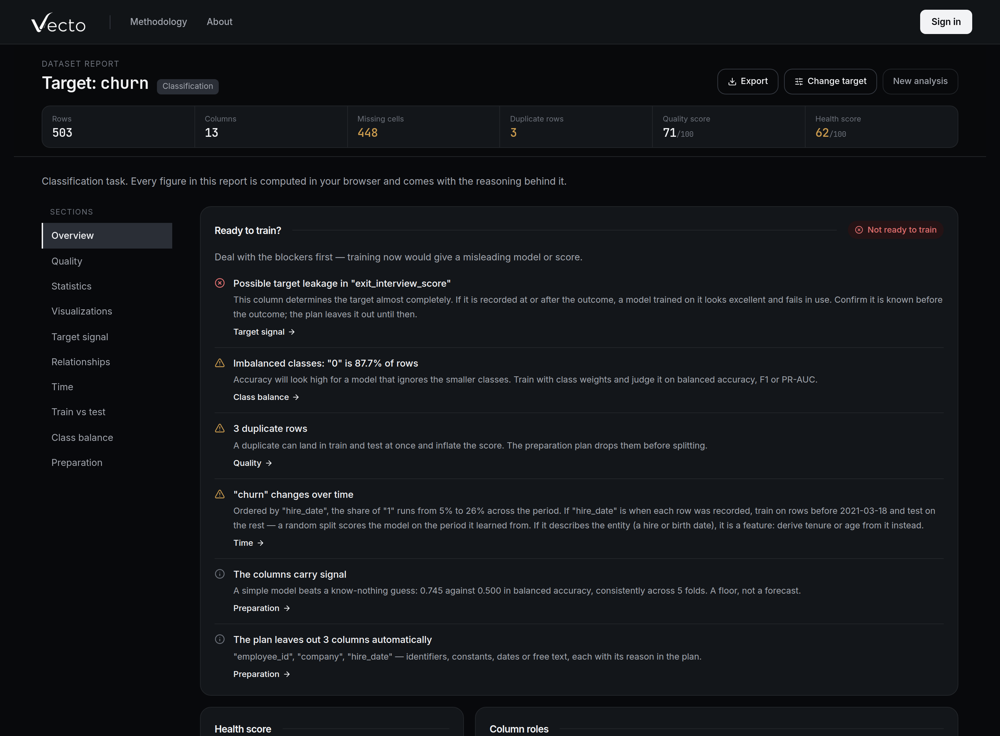
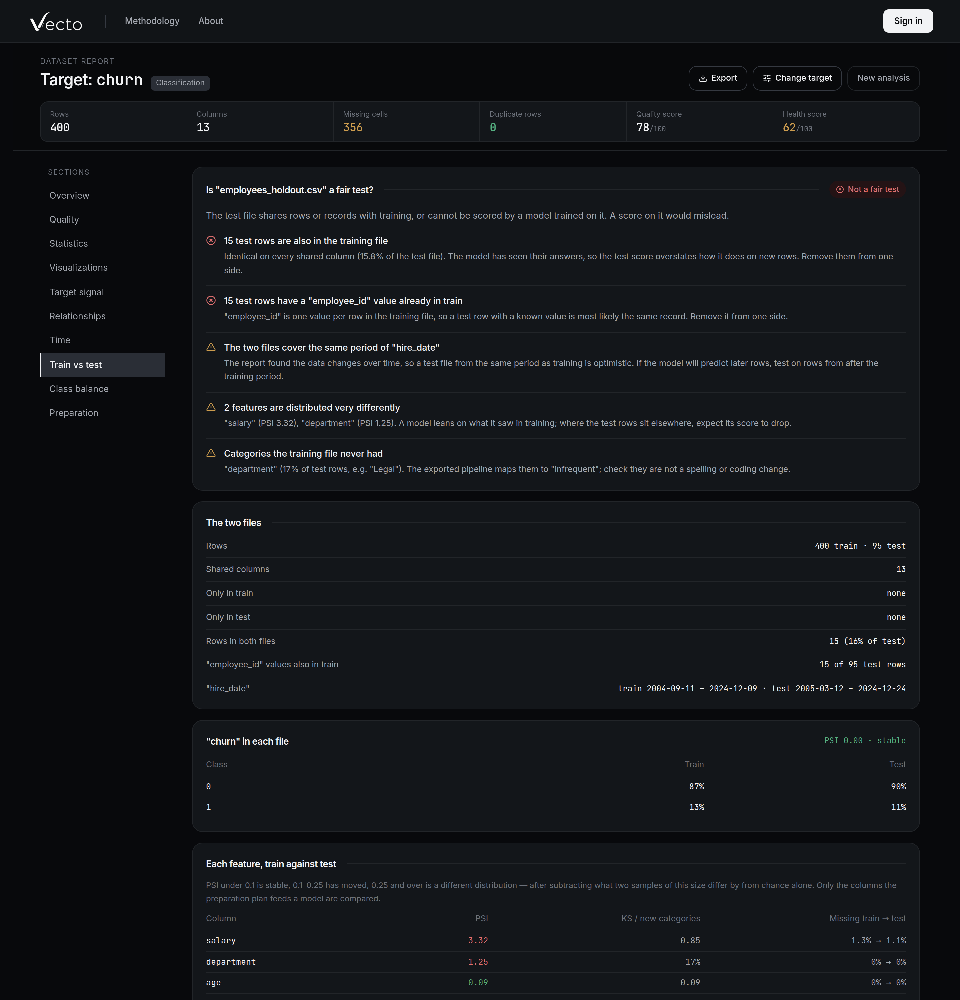
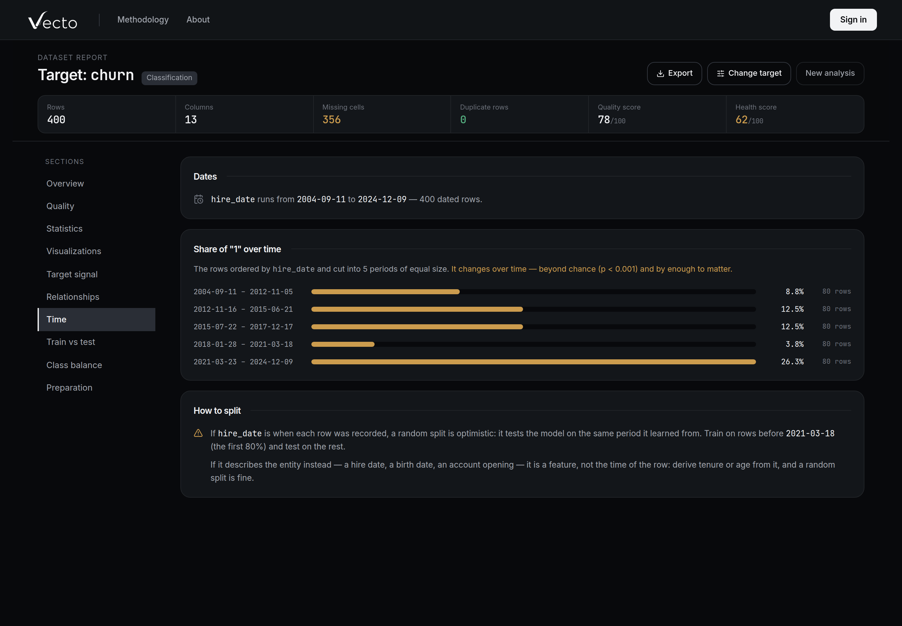
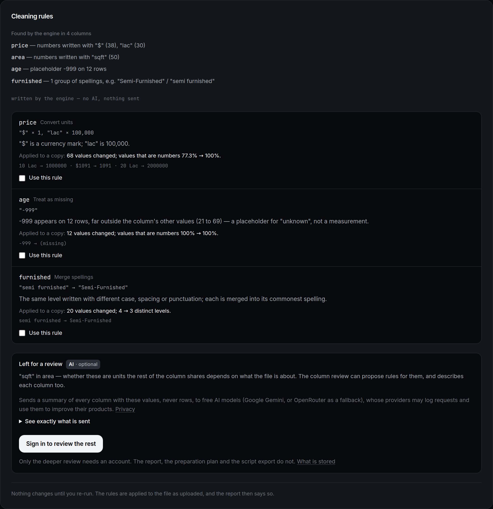
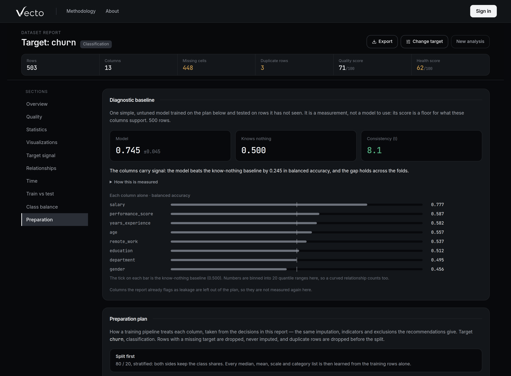
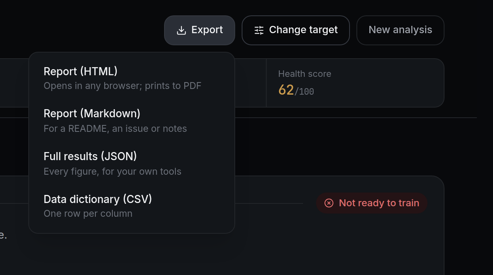
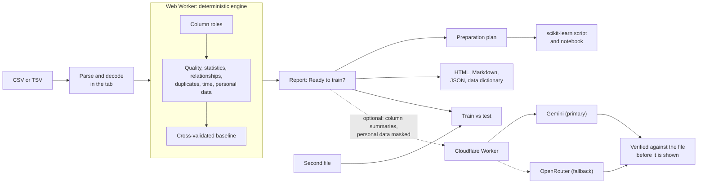

<p align="center">
  
</p>

<h3 align="center">Know your dataset before you train on it.</h3>

<p align="center">
  A pre-training check for tabular machine learning. Vecto finds target leakage, split mistakes and
  data problems <b>in your browser</b> — the file is never uploaded — and tells you what to fix first.
</p>

<p align="center">
  <a href="https://github.com/ashrafjr-n/Vecto/actions/workflows/ci.yml"></a>
  
  
  <a href="LICENSE"></a>
</p>

<p align="center">
  <a href="https://vecto.aannaelj.workers.dev"><b>Open Vecto</b></a> ·
  <a href="https://vecto.aannaelj.workers.dev/analyze?sample=1">Sample report</a> ·
  <a href="https://vecto.aannaelj.workers.dev/methodology">Methodology</a> ·
  <a href="https://vecto.aannaelj.workers.dev/privacy">Privacy</a>
</p>

<p align="center">
  
</p>

---

## Why

Most models that look good in evaluation and fail in use fail for a reason that was **in the data
before training started**: a column recorded after the outcome, the same customer in train and test,
a test set drawn from a different period, labels that contradict each other. None of these raise an
error. They raise the score.

Vecto answers one question before you spend time on a model:

> **Can this file be trained on as it stands — and if not, what comes first?**

Every report opens with that answer, and every line of it links to the evidence.

<p align="center">
  
</p>

## What it catches

| Problem | How Vecto finds it | Section |
|---|---|---|
| **Target leakage** | Columns that restate the target (Pearson, Spearman, bias-corrected Cramér's V, rank η, mutual information); columns whose *presence* gives it away; columns a model can predict it from almost perfectly on their own | Target signal |
| **Train / test contamination** | Rows in both files, one-per-row ids on both sides, groups shared across the split | Train vs test |
| **Distribution shift** | PSI corrected for sample size, two-sample KS, categories the training file never had, missing values that changed | Train vs test |
| **Leakage through time** | The target drifting across the collection period; columns that only exist from part-way through; dates in the future | Time |
| **Contradictory labels** | Rows identical on every feature with different targets — and a note instead when the features are simply too coarse to separate them | Quality |
| **The same record twice** | Rows identical except for their id, which a random split puts on both sides | Quality |
| **Weak or no signal** | A class-weighted ridge baseline, 5-fold cross-validated against a know-nothing guess | Preparation |
| **Imbalance** | Class shares, with the metric to use instead of accuracy | Class balance |
| **Dirty values** | `$1,200`, `42 Lac`, `125+`, `-999`, `semi furnished` vs `Semi-Furnished` — rules written by the engine and measured on a copy | Quality |
| **Personal data** | Email addresses, phone numbers, card numbers, IBANs, IP and web addresses | Quality |

## A tour

<table>
  <tr>
    <td width="50%" valign="top">
      <b>Train vs test</b><br>
      Add the file you will test on. Vecto checks it against the training file and says whether it is a
      fair test.<br><br>
      
    </td>
    <td width="50%" valign="top">
      <b>Time</b><br>
      With a date column, the rows are cut into periods in date order and the target is read across them.<br><br>
      
    </td>
  </tr>
  <tr>
    <td width="50%" valign="top">
      <b>Cleaning rules, no AI</b><br>
      Values whose meaning does not depend on the file get a rule from the engine; only the rest is left for
      an optional review.<br><br>
      
    </td>
    <td width="50%" valign="top">
      <b>Preparation, and what comes next</b><br>
      A baseline, a per-column plan, and a scikit-learn script and notebook that repeat it.<br><br>
      
    </td>
  </tr>
</table>

<p align="center">
  
  <br><sub>Every report exports as HTML, Markdown, JSON or a data dictionary — built in the browser, never carrying the rows.</sub>
</p>

## How it works


```mermaid
flowchart LR
    csv["CSV or TSV"] --> parse["Parse and decode<br/>in the tab"]
    parse --> engine

    subgraph engine["Web Worker: deterministic engine"]
        direction TB
        roles["Column roles"] --> measure["Quality, statistics, relationships,<br/>duplicates, time, personal data"]
        measure --> baseline["Cross-validated baseline"]
    end

    engine --> report["Report: Ready to train?"]
    report --> plan["Preparation plan"]
    plan --> script["scikit-learn script<br/>and notebook"]
    report --> exports["HTML, Markdown,<br/>JSON, data dictionary"]
    test["Second file"] --> compare["Train vs test"]
    report --> compare

    report -. "optional: column summaries,<br/>personal data masked" .-> cf["Cloudflare Worker"]
    cf --> gemini["Gemini (primary)"]
    cf -.-> openrouter["OpenRouter (fallback)"]
    gemini --> verify["Verified against the file<br/>before it is shown"]
    openrouter --> verify
```

Everything above the dotted line runs in the browser, with no request. The report is complete without
the AI layer, without an account and without the network.

## Built to be trusted

A tool that tells you a model will fail has to be right about it. Vecto's answers are
deterministic — the same file and target give the same report every time, down to the seeded folds —
and each piece is checked against an independent implementation:

| What | Checked against |
|---|---|
| Statistics, p-values, correlations, skew-adjusted outlier fences | pandas and scipy, on reference datasets |
| The ridge baseline, including balanced class weights | scikit-learn's `Ridge` and `RidgeClassifier(class_weight="balanced")` |
| Kolmogorov–Smirnov D | `scipy.stats.ks_2samp` |
| The exported scripts | Run in Python on classification, regression, grouped, time-split and grouped-plus-time plans |
| The exported notebook | Validated with `nbformat`, and executed |
| The whole engine and UI contract | **800+ automated checks** in CI on every push; a failing check stops a deploy |

It is also careful about what it does *not* know:

- **A limit is stated, not hidden.** A score held down carries the reason; a column the engine could not
  measure is named as unmeasured, never shown as clean.
- **Small samples are not called shifted.** PSI is corrected for the difference two samples of one
  distribution show by chance alone.
- **Meaning is handed back.** Whether a date is when a row was recorded or describes the person in it
  changes the right split, so the advice gives both readings instead of guessing.

## Privacy by design

- **The file never leaves the browser.** Parsing, analysis, cleaning, the comparison and every export
  run in the tab.
- **Saved reports are reports, not files.** The last ten are kept in this browser's IndexedDB so a
  refresh does not lose them — without the rows — and can be deleted from the home page.
- **Exports carry no rows**, and any personal value in a data dictionary is masked.
- **The AI review is opt-in** and receives column summaries only. Email addresses, phone numbers and
  similar values are replaced by placeholders such as `[email]` before anything is sent, and the page
  shows exactly what will be sent first.
- **Locked down.** A strict Content-Security-Policy: besides the app's own code, the only script allowed
  is Cloudflare's cookieless analytics, and the page can talk only to its own API.

## Where AI earns its place

The engine does the measuring. A model is asked only what values cannot say: what an ambiguous column
means, whether a strong predictor is known before the outcome, and whether a unit such as `sqft` is the
one the rest of the column uses. Answers come from **Google Gemini**, with **OpenRouter** as a fallback
and a per-provider daily budget; every claim is checked against the file before it is shown, labelled as
AI, and changes the report only when you accept it.

## Try it

Open the [live app](https://vecto.aannaelj.workers.dev) or the [sample report](https://vecto.aannaelj.workers.dev/analyze?sample=1),
or use the files in [`docs/demo`](docs/demo):

| File | What Vecto finds |
|---|---|
| [`employees.csv`](docs/demo/employees.csv) | A target leak, class imbalance, churn rising for recent hires |
| [`employees_holdout.csv`](docs/demo/employees_holdout.csv) | Compared with the file above: copied rows, shared ids, a salary shift and a new department |
| [`listings_messy.csv`](docs/demo/listings_messy.csv) | Prices in `$` and `Lac`, a `-999` placeholder, one category spelled two ways, areas in `sqft` |

## Run it locally

```bash
git clone https://github.com/ashrafjr-n/Vecto.git
cd Vecto
npm install
npm run dev          # http://localhost:3001
```

That is the whole product except the optional review. For that half, copy `.dev.vars.example` to
`.dev.vars`, add a `GEMINI_API_KEY` (and optionally `OPENROUTER_API_KEY`), and run `npx wrangler dev`
alongside the dev server, which proxies `/api` to it.

```bash
npm test             # 800+ checks: engine, AI layer, preparation, exports, comparison
npm run lint
npm run build
```

## Project structure

```text
src/
├── components/utils/core/   the analysis engine — pure functions, no network
│   ├── analyzers/           quality, statistics, relationships, duplicates
│   └── detectors/           column roles, target, dates, personal data
├── lib/
│   ├── prep/                preparation plan, baseline model, folds, scikit-learn export
│   ├── export/              HTML, Markdown, JSON and data-dictionary exports
│   ├── ai/                  review and leakage payloads, cleaning rules, verifiers
│   ├── readiness.js         the "Ready to train?" verdict
│   ├── compare.js           train vs test
│   ├── timeChecks.js        drift over time, late columns, split cutoff
│   └── savedReports.js      the last ten reports, in IndexedDB
├── components/analyze/      the report and its sections
└── pages/                   routes
worker/                      Cloudflare Worker: GitHub sign-in, quotas, Gemini and OpenRouter
tests/                       plain-Node suites, run in CI
docs/demo/                   files to try
```

## Tech stack

- **Frontend** — React 19 · Vite · Tailwind CSS · Framer Motion · PapaParse · Web Workers · IndexedDB
- **Backend** — Cloudflare Workers · D1 · Workers Static Assets
- **AI** — Google Gemini API (primary) · OpenRouter (fallback)
- **Quality** — GitHub Actions CI · a deploy gated on the test suite

## Limits

Honest ones: files up to 40 MB of delimited text (CSV, TSV, TXT) — no Excel or Parquet yet; the whole
file is held in the browser's memory; one date column is read for the time checks (the one with the
most readable dates); and the engine judges values, not meaning — which is exactly why it says so when
the answer depends on what a column is.

## Author

Built by **Ashraf** — a personal project in full-stack engineering, data analysis and careful use of AI.
[Live app](https://vecto.aannaelj.workers.dev) · [Source](https://github.com/ashrafjr-n/Vecto) ·
[MIT License](LICENSE)
